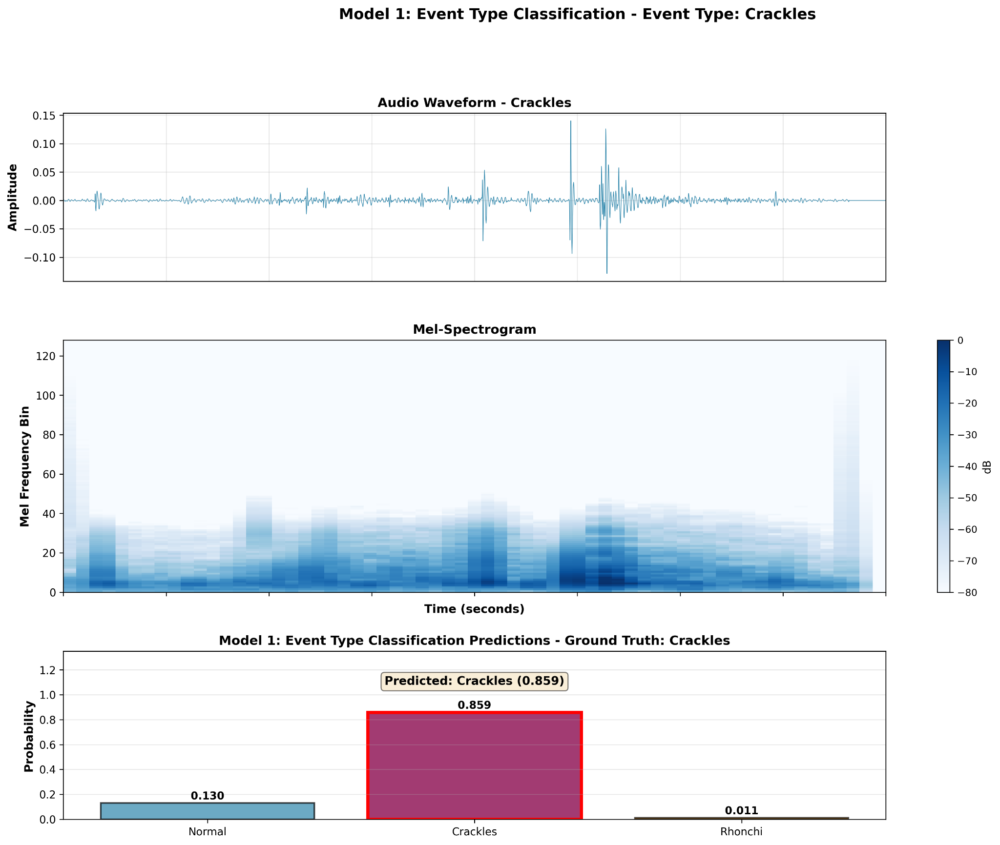
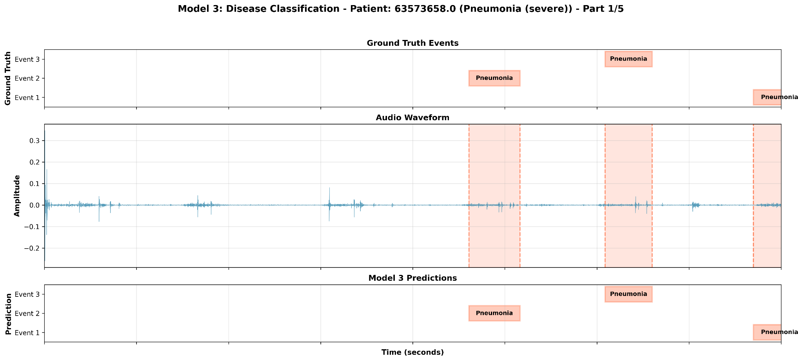
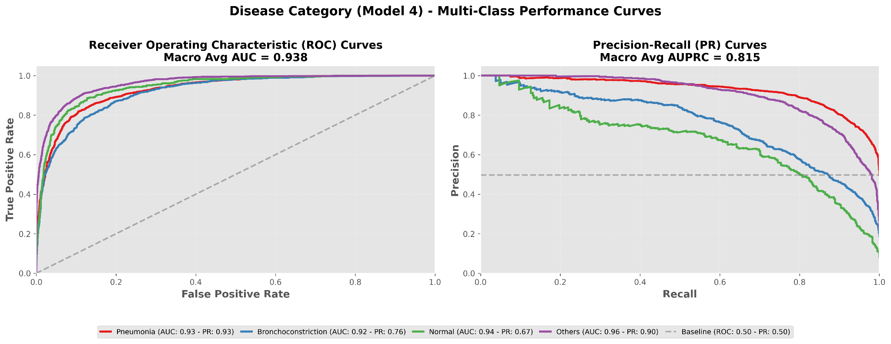

# Methods

## Study overview

Bu çalışma, akciğer/solunum seslerinden birden fazla klinik hedefi
eşzamanlı olarak öngörmek amacıyla, Google Research tarafından
geliştirilen HeAR (Health Acoustic Representations) ön-eğitimli ses
kodlayıcısını omurga (backbone) olarak kullanan iki aşamalı bir mimari
üzerine kuruludur. İlk aşamada, HeAR ile elde edilen 512-boyutlu akustik
temsiller üzerine inşa edilen üç görev-özgül base sınıflandırıcı, aynı
ses klibinden farklı klinik perspektifleri yansıtan olasılık çıktıları
(predict_proba) üretir. İkinci aşamada, bu olasılık vektörleri yaş,
cinsiyet ve kayıt lokasyonu gibi temel metadata değişkenleriyle
birleştirilerek tek bir özellik uzayı oluşturulur ve nihai tahmin,
stacking meta-modeli olarak eğitilen LightGBM aracılığıyla yapılır. Bu
yapı, base modellerin tamamlayıcı karar sinyallerini "model-üstü" bir
öğrenme katmanında bir araya getirerek hem ayırt ediciliği hem de klinik
uygulanabilirliği artırmayı hedefler.

HeAR omurgası, sağlıkla ilişkili akustik sinyaller için genellenebilir
temsiller üretmek üzere tasarlanmış bir foundation audio encoder'dır ve
büyük ölçekli web sesleri üzerinde masked autoencoder (MAE) yaklaşımıyla
ön-eğitilmiştir. HeAR çalışmasında, ön-eğitim havuzunun yaklaşık 313
milyon adet, 2 saniyelik, 16 kHz klipten oluştuğu ve zaman-frekans
temsili üzerinde yüksek oranlı maskeleme ile (ör. \~%75) yeniden
yapılandırma hedefiyle temsil öğreniminin gerçekleştirildiği
raporlanmaktadır. Bu ölçek ve eğitim hedefi, gürültü, cihaz farklılığı
ve bağlam çeşitliliği karşısında dayanıklı (robust) bir akustik temsil
uzayı elde etmeyi amaçlar. Mimari açıdan HeAR, zaman-frekans
"patch/token" temsillerini işleyen Transformer/ViT-türevli bir encoder
kullanır; ön-işleme hattı ise dinamik aralık ve arka plan gürültüsü
değişkenliğine daha dayanıklı olması hedeflenen PCEN (per-channel energy
normalization) tabanlı bir normalizasyon yaklaşımını destekler.

## Data sources and event-level sample construction

SPRSound, pediatrik popülasyondan toplanan solunum/akciğer seslerini ve
bu kayıtlara ilişkin kayıt-düzeyi (record-level) ve olay-düzeyi
(event-level) anotasyonları birlikte sunan, açık kaynaklı ve sürüm
bazında her sene genişleyen bir solunum sesi veritabanıdır. Kayıtlar
Shanghai Children's Medical Center (SCMC) pediatrik solunum kliniğinde,
elektronik stetoskop kullanılarak elde edilmiştir. Kayıt lokasyonu,
temel olarak dört standart oskültasyon bölgesini (p1--p4) temsil eder.
Veri seti, hem kayıt-düzeyinde (örn. Normal, CAS/DAS varyantları ve
"Poor Quality") hem de olay-düzeyinde (Normal, Rhonchi, Wheeze, Stridor,
Fine/Coarse Crackle, Wheeze+Crackle) anotasyonlar sunar; olay-düzeyi
anotasyonlar milisaniye cinsinden başlangıç/bitiş zamanları ve olay tipi
bilgisi içerir. Ham SPRSound anotasyonları, hekim/uzman etiketleyiciler
tarafından işaretlenmiş olayları (ör. crackle, wheeze gibi) zaman
damgalarıyla birlikte sağlar ve toplamda IEEE ve Github@da 57.123
anotasyonlu event'a ulasilmistir. Bu çalışmada, öncelikle veri seti
dizinleri taranarak aynı kaydın birden fazla kez temsil edilmesine yol
açabilecek olası duplicate kayıtlar giderildi. Ardından, SPRSound'un
kayıt-düzeyi kalite etiketlemesi kullanılarak "Poor Quality" olarak
işaretlenen düşük sinyal kalitesine sahip kayıtlar dışlandı; ek olarak
olay-düzeyi anotasyonu bulunmayan kayıtlar analiz dışında bırakıldı.
*SPRSound'un tanımında, bazı sonraki yıl test setlerinde yalnızca
olay-düzeyi anotasyonun bulunabileceği ve kayıt-düzeyi anotasyonun yer
almayabileceği belirtilmektedir; bu nedenle kürasyon adımı kayıt-düzeyi
anotasyona zorunlu bağımlı olmayacak şekilde tasarlanmış, olay-düzeyi
anotasyon mevcut olduğu sürece kayıtlar kullanılabilir kabul edilmiştir.
Bu filtreleme, "modelin öğrenmesi gereken şey" olan klinik olay
pencerelerini netleştirerek, hem etiket gürültüsünü hem de sinyal
kalitesi kaynaklı dağılım kaymalarını azaltmayı hedefler.*

Kürasyon sonrası nihai analiz kohortu 1.167 benzersiz hasta ve
olay-temelli kırpma (event-centric clipping) sonrası 24.808 etiketli ses
segmentinden oluşacak şekilde tanımlandı. SPRSound veri setinde model
çıktıları iki düzeyde tanımlandı: (i) olay-düzeyi (event) akustik
fenotip sınıfları ve (ii) hastalık-düzeyi (disease) klinik tanı
sınıfları. Olay düzeyinde anotasyonlar, normal solunum sesine ek olarak
patolojik oskültasyon paternlerini kapsayacak şekilde Normal, Fine
Crackle, Coarse Crackle, Wheeze, Wheeze+Crackle, Rhonchi ve Stridor
kategorileri altında raporlanmıştır. Hastalık düzeyinde ise her kayıt,
pediatrik solunum hastalık spektrumunu temsil eden 17 tanı sınıfından
birine atanmıştır. Bu çalışmada, analiz hedefleri klinik
uygulanabilirliği artırmak amacıyla bu ham sınıflar üzerinden türetilmiş
"outcome" grupları olarak kurgulandı: event düzeyinde (örn. Normal,
Crackles, Rhonchi/Wheeze şeklinde) ve disease düzeyinde (örn. Pneumonia,
Bronchoconstriction, Normal, Others gibi) daha kompakt sınıflandırma
hedefleri oluşturularak model eğitiminde kullanıldı. Eğitim/doğrulama
ayrımı, sınıflandırma görevlerinde genel yaklaşımı yansıtır biçimde %80
eğitim olacak şekilde yapıldı ve eğitim setine n=19.846 örnek dahil
edildi (kalan %20 örnek doğrulama/test amaçlı ayrılmıştır).

## Base classifiers and label design

Model girdisi oluşturma aşamasında, her olay segmenti için WAV
sinyalinden sabit uzunlukta klip çıkarıldı. Tüm sesler mono kanala
indirgenerek 16 kHz örnekleme oranına getirildi. Her örnek 2.0 saniyelik
bir pencere (clip) olarak standardize edildi (kısa ise pad, uzun ise
trim). Olayın tam sınırlarına annotation jitter genellenebilirliği
azaltmaması için, olay penceresi etrafında %10 örtüşme/oynama payı
(overlap) tanımlandı.

Akustik temsil öğrenimi için omurga (backbone) olarak Google Research
tarafından geliştirilen HeAR (Health Acoustic Representations) modeli
kullanıldı. HeAR, sağlıkla ilişkili akustik sinyallerden (örn. öksürük,
solunum, çevresel sağlık sesleri) genellenebilir temsil vektörleri
üretmek üzere büyük ölçekli ön-eğitim (pretraining) ile öğrenilmiş bir
ses kodlayıcıdır. Mimari olarak HeAR, zaman-frekans alanında oluşturulan
giriş yamalarını (patch/tokens) işleyen Transformer tabanlı bir encoder
içerir ve temsilleri self-attention mekanizması ile küresel bağlamı
modelleyerek üretir. Model, masked autoencoder (MAE) paradigmasıyla,
yüksek hacimli ve heterojen bir ses havuzunda maskelenmiş giriş
parçalarını yeniden yapılandırma hedefi üzerinden eğitilmiştir; HeAR
makalesinde bu amaçla kullanılan YT-NS ön-eğitim havuzunun yaklaşık
313,3 milyon adet 2 saniyelik klipten oluştuğu belirtilmektedir. Bu
ölçek, modelin gürültü, cihaz farkı ve bağlam değişkenliğine karşı daha
dayanıklı temsiller öğrenmesini hedefleyen kritik bir tasarım
tercihidir. HeAR'ın ön-işleme hattı, log-mel tabanlı zaman-frekans
temsilleri ve PCEN (per-channel energy normalization) gibi normalizasyon
adımlarını destekleyerek özellikle dinamik aralık ve arka plan gürültüsü
değişkenliğine karşı daha stabil bir temsil üretimini amaçlar.
Uygulamada, Hugging Face üzerinden sağlanan google/hear-pytorch
ağırlıkları kullanılarak her 2 saniyelik klip için sabit boyutlu bir
gömme (embedding) elde edildi; projede embedding boyutu 512 olarak
yapılandırıldı.

HeAR kodlayıcısı (encoder), bu çalışmada her 2 saniyelik klip için sabit
boyutlu bir akustik temsil (embedding) üreten ortak bir "özellik
çıkarıcı" (feature extractor) olarak kullanıldı. Encoder'ın ürettiği
temsil vektörü 512 boyutludur ve tüm modellerde aynı şekilde korunmuştur
(EMBEDDING_DIM=512). Bu temsilin üzerine, görev-özgül bir sınıflandırma
başlığı (classification head) eklenerek üç ayrı temel model (base
learner) eğitildi. Sınıflandırma başlığı, 512 boyutlu embedding'i önce
daha düşük boyutlu bir ara uzaya projekte eden tek bir tam bağlantılı
katman (Linear 512→256) ve doğrusal olmayan aktivasyon ile
yapılandırıldı; ardından dropout=0.3 ile düzenlileştirme uygulanıp
ikinci bir tam bağlantılı katman ile çıktı sınıf sayısına uygun lojitler
üretildi (Linear 256→K). Böylece her model, HeAR'ın paylaşılan akustik
temsili üzerinde kendi hedef görevine özgü karar sınırlarını
öğrenebilecek şekilde "ince" fakat yeterli kapasitede bir karar
katmanına sahip oldu.

Üç temel modelin her biri, aynı ses klibine farklı bir klinik
perspektiften bakacak şekilde tasarlandı ve bu sayede stacking
katmanında birbirini tamamlayan (komplementer) olasılık çıktıları
üretmesi amaçlandı. Birinci model, oskültasyonda en sık karşılaşılan
temel akustik fenotipleri hedefleyen 3-sınıflı olay-tipi problemi olarak
tanımlandı ve çıktıları Normal, Crackles, Rhonchi olacak şekilde
kurgulandı. Burada Fine ve Coarse crackle alt tipleri "Crackles" sinifi
altında birleştirilirken, wheeze rhonchi benzeri süreğen patolojik
paternler "Rhonchi" çatısı altında toplandı. İkinci model, klinik tarama
senaryolarında pratik bir karar noktası sağlamak için binary Normal ve
Abnormal ayrımı yapacak şekilde tasarlandı, Normal dışındaki tüm olay
etiketleri "Abnormal" altında birleştirildi. Üçüncü model ise olay
düzeyi bulguları daha üst düzey klinik tanı bağlamına bağlamak amacıyla
3-sınıflı hastalık grubu problemi olarak kuruldu ve Pneumonia,
bronkokonstruktif sesler (bronchitis asthma bronchiolitis) ve diger
çıktıları hedeflendi. Bu çoklu görev kurgusu, HeAR temsillerinin hem
düşük seviyeli akustik morfoloji (crackle, wheeze/rhonchi) hem de daha
klinik anlamlı sendrom kümeleri (pnömoni ve bronkokonstriksiyon
spektrumu) açısından farklı ayrım eksenlerinde değerlendirilmesini
sağlayarak, meta-modelin daha zengin ve dayanıklı bir özellik uzayı
üzerinden öğrenmesine zemin hazırladı.

## Two-stage fine-tuning of HeAR encoders

Eğitim, self-supervised ön-eğitimli HeAR kodlayıcısının denetimli hedef
görevlere aktarılması prensibine dayanan iki aşamalı bir fine-tuning
protokolü ile gerçekleştirildi. İlk aşamada, HeAR kodlayıcısı
dondurularak (encoder frozen) yalnızca görev-özgül sınıflandırma başlığı
optimize edildi; bu yaklaşım, ön-eğitim sırasında öğrenilmiş genel
amaçlı akustik temsilleri korurken hedef veri setinin etiket uzayına
hızlı ve stabil bir adaptasyon sağlamayı amaçladı. İkinci aşamada
kodlayıcı katmanları açılarak (encoder unfrozen) model uçtan uca ince
ayara alındı ve belirgin biçimde daha düşük bir öğrenme oranıyla temsil
uzayı hedef göreve kontrollü şekilde uyarlandı. Böylece sınırlı etiketli
tıbbi ses verisi koşullarında, bir yandan aşırı uyum (overfitting) ve
catastrophic forgetting riski azaltılırken, diğer yandan görev-özgül
ayrıştırıcılığın artırılması hedeflendi.

Tüm temel modellerde eğitim hiperparametreleri konfigürasyon dosyaları
aracılığıyla standartlaştırıldı. Birinci aşama eğitim 10 epoch boyunca
LR=1×10⁻⁴ ile yürütüldü; ikinci aşama uçtan uca fine-tuning ise 40 epoch
boyunca LR=5×10⁻⁷ ile sürdürüldü. Mini-batch büyüklüğü 32 olarak
belirlendi ve düzenlileştirme amacıyla weight decay=1×10⁻⁴ kullanıldı.
Etkin batch boyutunu artırmak ve gradyan kestirimindeki varyansı
azaltmak için gradient accumulation=2 uygulandı. Optimizasyon sırasında
kararlılığı artırmak ve uç değer gradyanların eğitimi bozmasını
engellemek için gradyanlar max grad norm=0.5 ile kırpıldı (gradient
clipping). Sınıf dengesizliği, kayıp fonksiyonunda sınıf
ağırlıklandırması kullanılarak ele alındı; ayrıca doğrulama
performansına bağlı olarak erken durdurma (early stopping) ve
plateau-tabanlı öğrenme oranı azaltma mekanizmaları devreye alındı. Bu
mekanizmaların "patience" gibi kontrol parametreleri boru hattında kod
düzeyinde tanımlanarak deneylerin tekrar üretilebilirliği güvence altına
alındı.

Temel (base) modeller eğitildikten sonra, stacking katmanını oluşturmak
amacıyla her bir event örneği için model olasılık çıktıları
(predict_proba) çıkarıldı ve bu çıktılar meta-öğrenicinin girdi
özellikleri olarak yapılandırıldı. Eğitim bölmesindeki tüm event
klipleri üç base modele ayrı ayrı verilerek softmax olasılık vektörleri
üretildi; böylece Model-1'in üç sınıf olasılığı, Model-2'nin iki sınıf
olasılığı ve Model-3'ün üç sınıf olasılığı birleştirilerek event başına
toplam sekiz olasılık temelli özellik elde edildi (3+2+3). Bu olasılık
tabanlı temsil, yalnızca "en olası sınıf" etiketini değil, sınıflar
arası ayrım gücünü ve karar belirsizliğini de meta-model katmanına
taşıdığı için tercih edildi. Olasılık özellikleri, her event örneği için
mevcut olan yaş, cinsiyet ve kayıt lokasyonu gibi demografik/bağlamsal
değişkenlerle birleştirilerek tek bir meta-özellik matrisi oluşturuldu;
böylece meta-öğrenici, akustik fenotip olasılıklarını klinik bağlamla
birlikte kullanabilecek biçimde tanımlandı.

## Stacking meta-learning and LightGBM optimization

Meta-öğrenme katmanında hedef değişkenler, aynı akustik girdiden farklı
klinik karar düzeylerine karşılık gelecek biçimde altı ayrı outcome
olarak tanımlandı. İlk iki outcome, veri setinin ham anotasyonlarını
doğrudan yansıttı: event_type olay-düzeyi akustik fenotip sınıflarını (7
sınıf: Normal, Fine Crackle, Coarse Crackle, Wheeze, Wheeze+Crackle,
Rhonchi, Stridor) ve disease kayıt-düzeyi klinik tanı etiketlerini (17
sınıf) temsil etti. Kalan dört outcome, klinik uygulanabilirliği
artırmak ve meta-modelin farklı granülaritede karar fonksiyonlarını
öğrenmesini sağlamak amacıyla türetilmiş (derived) etiketler olarak
kurgulandı: model1_label olay tiplerini daha kompakt bir akustik fenotip
uzayına indirgedi (3 sınıf: Normal, Crackles, Rhonchi; burada
Fine--Coarse crackle alt tipleri "Crackles" altında birleştirildi),
model2_label tarama senaryolarını yansıtacak şekilde tüm patolojik
olayları "Abnormal" altında toplayan ikili bir hedef tanımladı (2 sınıf:
Normal, Abnormal), model3_label olay-düzeyi bulguları klinik sendrom
kümelerine eşleyerek hastalık grubu ayrımı yaptı (3 sınıf: *Pneumonia /
Bronchitis-Asthma-Bronchiolitis / Normal-Other*), ve model4_label daha
geniş klinik karar uzayı için hastalık gruplarını dört sınıfa genişletti
(4 sınıf: Pneumonia, Bronchoconstriction, Normal, Others). Bu yapı
sayesinde meta-model, hem ham anotasyon çözünürlüğünde hem de klinik
açıdan daha uygulanabilir gruplandırmalarda performans değerlendirmesine
olanak verecek şekilde tasarlandı.

Meta-model eğitimi için bu olasılık+demografi tabanlı veri seti,
meta-öğrenme aşamasında bağımsız doğrulama sağlayacak şekilde yeniden
%80--%20 oranında eğitim/doğrulama olarak ayrıldı ve sınıf dağılımını
korumak amacıyla stratified bölme uygulandı. Meta-öğrenici olarak
gradient boosting tabanlı LightGBM seçildi ve projede klinik kullanım
senaryolarını yansıtacak biçimde tanımlanan altı farklı outcome için
ayrı LightGBM sınıflandırıcıları eğitildi. Bu kurulumda tüm LightGBM
modelleri aynı giriş uzayını (8 olasılık + yaş + cinsiyet + kayıt
lokasyonu) paylaşırken, yalnızca hedef değişken (outcome label) farklı
tutuldu; böylece ortak olasılık temsillerinin farklı klinik hedefler
arasında taşınabilirliği ve görevler arası kıyaslanabilirlik sağlandı.

LightGBM hiperparametreleri, meta-model performansını sistematik olarak
iyileştirmek amacıyla Optuna kullanılarak optimize edildi. Optimizasyon
kapsamında öğrenme oranı, ağaç yapısı karmaşıklığını belirleyen
parametreler (örn. num_leaves, min_child_samples), örnekleme oranları
(feature_fraction, bagging_fraction) ve düzenlileştirme bileşenleri için
bir arama uzayı tanımlandı; her bir outcome için doğrulama seti
performansına göre en iyi konfigürasyon seçilerek nihai meta-model
yeniden eğitildi. Bu şekilde stacking katmanı, üç base modelden gelen
tamamlayıcı olasılık sinyalini demografik/çekim bağlamı ile birleştiren
ve doğrusal olmayan etkileşimleri yakalayabilen bir super learner olarak
konumlandırıldı.

## Model evaluation and uncertainty estimation

Performans değerlendirmesi, klinikte sık görülen sınıf dengesizliği
nedeniyle tek bir metrikle "başarılı/başarısız" demekten kaçınacak
şekilde kurgulandı. Bu nedenle hem base hem de LightGBM meta-modeller
için accuracy raporlansa da ana vurgu, her sınıfa eşit ağırlık veren
macro-F1 (ve tamamlayıcı olarak weighted-F1) gibi dengesizliğe daha
dayanıklı özet ölçütler üzerine kuruldu. Ayrıca sınıflandırma
hatalarının klinik olarak "neyi karıştırdığını" görünür kılmak için
confusion matrix ve sınıf-bazlı precision (PPV), recall (sensitivity),
specificity, NPV metrikleri ayrı ayrı hesaplandı. Bu sınıf-bazlı
metrikler, çok-sınıflı senaryoda one-vs-rest yaklaşımıyla (ilgili sınıf
"pozitif", diğer tüm sınıflar "negatif") tanımlanarak raporlandı. Model
performanslari ROC eğrileri ve Precision-Recall (PR) eğrileri birlikte
paylaşılacak şekilde standartlaştırıldı. Binary hedeflerde ROC-AUC
doğrudan pozitif sınıf olasılığı üzerinden hesaplanırken, multiclass
hedeflerde ROC/AUPRC hesapları one-vs-rest mantığıyla yürütüldü.
Raporlanan performans metrikleri, örnekleme belirsizliğini yansıtmak
amacıyla değerlendirme seti üzerinde nonparametrik bootstrap (1000
yeniden örnekleme) ile hesaplanan %95 güven aralıkları ile birlikte
sunuldu; bu yaklaşım özellikle nadir sınıflarda metriklerin
belirsizliğini nicel olarak raporlamayı sağladı.

# Results

SPRSound verilerinde ilk hedef, olay-temelli kırpılmış solunum
kliplerinde akustik fenotipin (normal vs patolojik ve patolojik fenotip
alt tipleri) güvenilir biçimde öğrenilmesiydi. Model çıktılarına ilişkin
kararlar, her örnek için sınıflar üzerinde üretilen softmax olasılıkları
üzerinden tanımlandı ve bir örnek üzerinde dalga formu, mel-spektrogram
ve sınıf olasılık dağılımının birlikte gösterildiği görsel özet Şekil
1'de sunuldu. Bu çerçevede ikili tarama modeli (Model-2;
Normal/Abnormal), doğrulama bölmesinde accuracy=0.92 (95% GA,
0.92--0.93), weighted-F1=0.92 (0.91--0.93) ve ROC-AUC=0.96 (0.95--0.97)
performansı gösterdi. Daha granüler olay fenotipi sınıflandırması (event
type), doğrulama bölmesinde accuracy=0.90 (0.89--0.91), weighted-F1=0.89
(0.88--0.90) ve ROC-AUC (OvR, weighted)=0.96 (0.95--0.96) olarak
raporlandı. Üç sınıflı Model-1 (Normal/Crackles/Rhonchi) için, Şekil
1'de örnek düzeyinde olasılık dağılımı ile uyumlu biçimde, doğrulama
bölmesinde accuracy=0.91 (0.90--0.92), weighted-F1=0.91 (0.90--0.92) ve
ROC-AUC (OvR, weighted)=0.96 (0.95--0.96) elde edildi; sınıf-bazlı
ölçütler Tablo 1'de sunuldu (Normal n=3743; Crackles n=813; Rhonchi
n=345).

+-----------+-------------+-----------------+--------------+-----------------+---------+-----------+
| **Sınıf** | **Precision | **Recall        | **F1-Score** | **Specificity** | **NPV** | **ROC-AUC |
|           | (PPV)**     | (Sensitivity)** |              |                 |         | (OvR)**   |
+-----------+-------------+-----------------+--------------+-----------------+---------+-----------+
| Normal    | 0.93        | 0.97            | 0.95         | 0.76            | 0.88    | 0.96      |
|           |             |                 |              |                 |         |           |
| (n=3743)  | \[0.92,     | \[0.96, 0.97\]  | \[0.94,      | \[0.74, 0.79\]  | \[0.86, | \[0.95,   |
|           | 0.94\]      |                 | 0.95\]       |                 | 0.89\]  | 0.96\]    |
+-----------+-------------+-----------------+--------------+-----------------+---------+-----------+
| Crackles  | 0.82        | 0.68            | 0.74         | 0.97            | 0.94    | 0.95      |
|           |             |                 |              |                 |         |           |
| (n=813)   | \[0.79,     | \[0.65, 0.72\]  | \[0.72,      | \[0.96, 0.97\]  | \[0.93, | \[0.94,   |
|           | 0.84\]      |                 | 0.77\]       |                 | 0.95\]  | 0.96\]    |
+-----------+-------------+-----------------+--------------+-----------------+---------+-----------+
| Rhonchi   | 0.88        | 0.83            | 0.86         | 0.99            | 0.99    | 0.98      |
|           |             |                 |              |                 |         |           |
| (n=345)   | \[0.84,     | \[0.80, 0.87\]  | \[0.83,      | \[0.99, 0.99\]  | \[0.98, | \[0.97,   |
|           | 0.91\]      |                 | 0.88\]       |                 | 0.99\]  | 0.99\]    |
+===========+=============+=================+==============+=================+=========+===========+

{width="6.5in" height="5.5in"}

*Şekil X, olay-temelli kırpma sonrası Crackles olarak anotasyonlanan 2
saniyelik bir segmentte modelin hedef olayı yakalayıp doğru
sınıfladığını nitel olarak göstermektedir. Görselde dalga formunda kısa
süreli, keskin genlik patlamaları ve mel-spektrogramda zaman boyunca
transient (kısa süreli) enerji artışları Crackles paternine uyumlu bir
morfoloji sergilerken, Model-1 bu örneği Crackles olarak yüksek güvenle
etiketlemiştir (Crackles olasılığı ≈ 0.86, Normal ≈ 0.13, Rhonchi ≈
0.01). Bu nitel örnek, Tablo 1'de raporlanan sınıf-bazlı nicel
sonuçlarla tutarlı olup, özellikle Crackles sınıfında modelin yüksek
özgüllük (yanlış pozitiflerin sınırlanması) ile çalıştığını, buna karşın
duyarlılığın (tüm Crackles örneklerini yakalama) daha orta düzeyde
kaldığını göstermektedir.*

Tanı düzeyindeki değerlendirmede amaç, aynı event-temelli akustik
girdiden türetilen temsillerin klinik olarak daha üst düzey karar
etiketlerine (disease/disease-category) ne ölçüde taşınabildiğini nicel
olarak göstermektir. Bu kapsamda, hastalık grubu ayrımını hedefleyen
Model-3 (3 sınıf) doğrulama bölmesinde accuracy=0.81 (95% GA,
0.80--0.82), weighted-F1=0.81 (0.80--0.82) ve ROC-AUC (OvR,
weighted)=0.93 (0.93--0.94) performansı ile raporlandı; daha geniş
klinik karar uzayını temsil eden Model-4 (4 sınıf) için ise
accuracy=0.80 (0.78--0.81), weighted-F1=0.79 (0.78--0.80) ve ROC-AUC
(OvR, weighted)=0.94 (0.93--0.94) elde edildi. Ham tanı etiketlerini
daha yüksek granülaritede hedefleyen disease modeli (17 sınıf),
doğrulama bölmesinde accuracy=0.74 (0.73--0.76) ve weighted-F1=0.73
(0.72--0.75) olarak raporlanırken, olasılık-ayrıştırma kapasitesi
ROC-AUC (OvR) ile yüksek düzeyde korundu (macro average=0.98
\[0.97--0.98\]; weighted average=0.94 \[0.93--0.94\]). Çok-sınıflı
senaryolarda performans eğrileri, one-vs-rest yaklaşımıyla hesaplanan
ROC ve Precision--Recall (PR) eğrileri olarak sunuldu; bu eğriler
üzerinden Model-4 için ROC eğrilerinin makro ortalama AUC=0.94 ve PR
eğrilerinin makro ortalama AUPRC=0.82 olduğu gösterildi (Şekil 2).
Model-4'e ait sınıf-bazlı ayrıntılı performans tablosu ana metinde Tablo
2 olarak sunulmuş olup, diğer tanı düzeyi modellerin sınıf-bazlı
metrikleri ve ek analizler yer kısıtı nedeniyle Supplementary'de
raporlanmıştır.

{width="6.5in" height="2.9305555555555554in"}

*Üst panelde aynı hastaya ait ardışık olayların (event 1--3)
ground-truth hastalık grubu etiketleri gösterilmektedir. Orta panel,
ilgili ses kaydının ham dalga formunu (amplitüd--zaman) sunar; gölgeli
bölgeler olay anotasyon pencerelerini, kesikli dikey çizgiler olay
başlangıç/bitiş sınırlarını temsil eder. Alt panelde ise Model-3'ün aynı
olay pencereleri için ürettiği tahminler (argmax sınıf) yer almaktadır.
Bu örnekte model, pnömoni ile etiketlenmiş olay pencerelerini tutarlı
biçimde "Pneumonia" olarak sınıflandırmıştır. Tüm tahminler, her olay
için softmax olasılıkları hesaplandıktan sonra en yüksek olasılığa sahip
sınıfın seçilmesiyle elde edilmiştir.*

{width="6.5in" height="2.513888888888889in"}

*Sol panel, çok-sınıflı sınıflandırma için one-vs-rest yaklaşımıyla
hesaplanan ROC eğrilerini; sağ panel, aynı kurulumla hesaplanan
Precision--Recall (PR) eğrilerini göstermektedir. Renkli eğriler
sınıf-bazlı performansı (Pneumonia, Bronchoconstriction, Normal, Others)
temsil eder; kesikli diyagonal çizgi ROC için rastgele sınıflandırma
referansını (AUC=0.50), kesikli yatay çizgi PR için sınıf-prevalansına
dayalı "baseline" düzeyini gösterir. Başlıkta raporlanan makro ortalama
AUC ve makro ortalama AUPRC, sınıf-bazlı AUC/AUPRC değerlerinin
aritmetik ortalamasıdır. Eğriler, doğrulama bölmesindeki her sınıfın
olasılık çıktıları kullanılarak oluşturulmuştur.*

+----------------+
| **Sınıf**      |
+----------------+
| Pneumonia      |
|                |
| (n=2436)       |
+----------------+
| Bronchoconstr. |
|                |
| (n=920)        |
+----------------+
| Normal         |
|                |
| (n=405)        |
+----------------+
| Others         |
|                |
| (n=1140)       |
+================+
