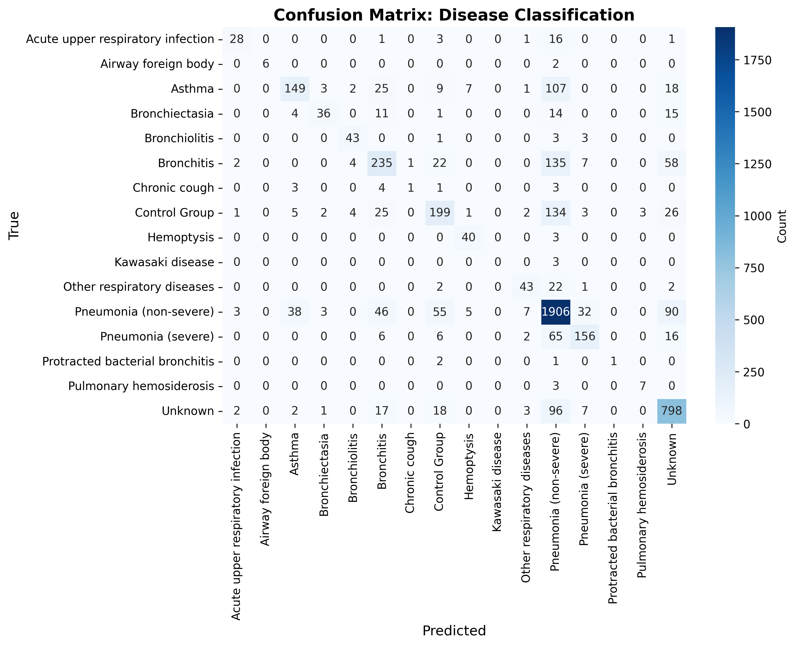

# LightGBM Meta-Model Report: Disease Classification

## Overview

This meta-model predicts **Disease Classification** using ensemble model probabilities and demographic features.

**Input Features (11 total):**
- Model 1 probabilities (3): Normal, Crackles, Rhonchi
- Model 2 probabilities (2): Normal, Abnormal
- Model 3 probabilities (3): Normal, Pneumonia, Bronchiolitis
- Demographics (3): age, gender, recording_location

**Output Classes:** 16
- Acute upper respiratory infection, Airway foreign body, Asthma, Bronchiectasia, Bronchiolitis, Bronchitis, Chronic cough, Control Group, Hemoptysis, Kawasaki disease, Other respiratory diseases, Pneumonia (non-severe), Pneumonia (severe), Protracted bacterial bronchitis, Pulmonary hemosiderosis, Unknown

---

## Performance Metrics (with 95% Confidence Intervals)

### Basic Metrics

#### Accuracy
- **Value**: 0.7445
- **CI95**: [0.7317, 0.7570]

#### Macro F1
- **Value**: 0.5991
- **CI95**: [0.5533, 0.6563]

#### Weighted F1
- **Value**: 0.7338
- **CI95**: [0.7193, 0.7474]

#### Matthews Correlation Coefficient (MCC)
- **Value**: 0.6451
- **CI95**: [0.6273, 0.6619]

### Probabilistic Metrics

#### Log-Loss
- **Value**: 0.7114
- **CI95**: [0.6867, 0.7351]

#### ROC-AUC (One-vs-Rest)

**Macro Average:**
- **Value**: 0.9763
- **CI95**: [0.9744, 0.9782]

**Weighted Average:**
- **Value**: 0.9373
- **CI95**: [0.9327, 0.9420]

### Per-Class Metrics

| Class | Precision (PPV) | Recall (Sensitivity) | F1-Score | Specificity | NPV | Support | ROC-AUC (OvR) |
|-------|------------------|----------------------|----------|-------------|-----|---------|---------------|
| Acute upper respiratory infection | 0.7798 [0.6363, 0.9167] | 0.5604 [0.4166, 0.7001] | 0.6493 [0.5195, 0.7587] | 0.9984 [0.9971, 0.9994] | 0.9955 [0.9934, 0.9973] | 50 | 0.9899 [0.9831, 0.9952] |
| Airway foreign body | 0.9980 [1.0000, 1.0000] | 0.7448 [0.3996, 1.0000] | 0.8425 [0.5710, 1.0000] | 1.0000 [1.0000, 1.0000] | 0.9996 [0.9990, 1.0000] | 8 | 0.9959 [0.9886, 1.0000] |
| Asthma | 0.7408 [0.6771, 0.8000] | 0.4643 [0.4106, 0.5191] | 0.5703 [0.5198, 0.6227] | 0.9887 [0.9856, 0.9915] | 0.9635 [0.9579, 0.9691] | 321 | 0.9470 [0.9368, 0.9562] |
| Bronchiectasia | 0.8021 [0.6757, 0.9070] | 0.4438 [0.3412, 0.5556] | 0.5694 [0.4651, 0.6667] | 0.9982 [0.9969, 0.9992] | 0.9907 [0.9879, 0.9932] | 81 | 0.9937 [0.9912, 0.9960] |
| Bronchiolitis | 0.8107 [0.6863, 0.9063] | 0.8603 [0.7586, 0.9524] | 0.8333 [0.7434, 0.9027] | 0.9979 [0.9965, 0.9992] | 0.9986 [0.9975, 0.9996] | 50 | 0.9978 [0.9953, 0.9994] |
| Bronchitis | 0.6353 [0.5868, 0.6848] | 0.5063 [0.4571, 0.5534] | 0.5632 [0.5218, 0.6033] | 0.9696 [0.9644, 0.9746] | 0.9494 [0.9430, 0.9557] | 464 | 0.9285 [0.9181, 0.9384] |
| Chronic cough | 0.4515 [0.0000, 1.0000] | 0.0866 [0.0000, 0.2857] | 0.1391 [0.0000, 0.4168] | 0.9998 [0.9994, 1.0000] | 0.9978 [0.9965, 0.9990] | 12 | 0.9972 [0.9955, 0.9987] |
| Control Group | 0.6250 [0.5681, 0.6760] | 0.4920 [0.4402, 0.5420] | 0.5503 [0.5059, 0.5950] | 0.9734 [0.9687, 0.9778] | 0.9551 [0.9486, 0.9609] | 405 | 0.9278 [0.9159, 0.9400] |
| Hemoptysis | 0.7588 [0.6415, 0.8684] | 0.9310 [0.8478, 1.0000] | 0.8347 [0.7470, 0.9091] | 0.9974 [0.9959, 0.9988] | 0.9994 [0.9986, 1.0000] | 43 | 0.9991 [0.9983, 0.9997] |
| Kawasaki disease | 0.0000 [0.0000, 0.0000] | 0.0000 [0.0000, 0.0000] | 0.0000 [0.0000, 0.0000] | 1.0000 [1.0000, 1.0000] | 0.9994 [0.9986, 1.0000] | 3 | 0.9974 [0.9947, 1.0000] |
| Other respiratory diseases | 0.7282 [0.6167, 0.8305] | 0.6122 [0.4930, 0.7124] | 0.6635 [0.5641, 0.7467] | 0.9967 [0.9950, 0.9981] | 0.9944 [0.9923, 0.9963] | 70 | 0.9882 [0.9812, 0.9937] |
| Pneumonia (non-severe) | 0.7584 [0.7404, 0.7751] | 0.8723 [0.8588, 0.8853] | 0.8113 [0.7988, 0.8241] | 0.7764 [0.7603, 0.7919] | 0.8832 [0.8699, 0.8956] | 2185 | 0.9120 [0.9046, 0.9195] |
| Pneumonia (severe) | 0.7460 [0.6807, 0.8047] | 0.6223 [0.5625, 0.6824] | 0.6781 [0.6268, 0.7273] | 0.9886 [0.9854, 0.9916] | 0.9798 [0.9759, 0.9839] | 251 | 0.9773 [0.9712, 0.9829] |
| Protracted bacterial bronchitis | 0.6120 [0.0000, 1.0000] | 0.2383 [0.0000, 1.0000] | 0.3249 [0.0000, 1.0000] | 1.0000 [1.0000, 1.0000] | 0.9994 [0.9986, 1.0000] | 4 | 0.9997 [0.9992, 1.0000] |
| Pulmonary hemosiderosis | 0.7047 [0.4000, 1.0000] | 0.6928 [0.3750, 1.0000] | 0.6870 [0.4000, 0.9000] | 0.9994 [0.9986, 1.0000] | 0.9994 [0.9986, 1.0000] | 10 | 0.9993 [0.9985, 0.9999] |
| Unknown | 0.7797 [0.7545, 0.8048] | 0.8456 [0.8231, 0.8709] | 0.8112 [0.7929, 0.8293] | 0.9429 [0.9359, 0.9506] | 0.9623 [0.9560, 0.9686] | 944 | 0.9706 [0.9662, 0.9750] |

---

## Visualizations

### Confusion Matrix

### ROC and Precision-Recall Curves

Each class has its own ROC curve (left) and Precision-Recall curve (right) in a one-vs-rest setting.

---

**Report Generated**: 2026-01-25 00:45:00
