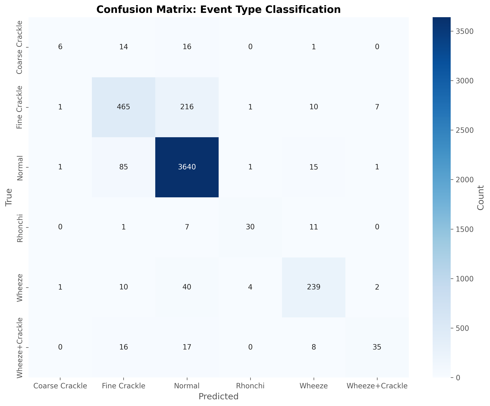
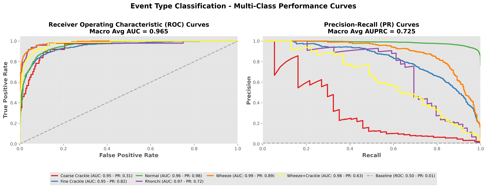

# LightGBM Meta-Model Report: Event Type Classification

## Overview

This meta-model predicts **Event Type Classification** using ensemble model probabilities and demographic features.

**Input Features (11 total):**
- Model 1 probabilities (3): Normal, Crackles, Rhonchi
- Model 2 probabilities (2): Normal, Abnormal
- Model 3 probabilities (3): Normal, Pneumonia, Bronchiolitis
- Demographics (3): age, gender, recording_location

**Output Classes:** 6
- Coarse Crackle, Fine Crackle, Normal, Rhonchi, Wheeze, Wheeze+Crackle

---

## Performance Metrics (with 95% Confidence Intervals)

### Basic Metrics

#### Accuracy
- **Value**: 0.9007
- **CI95**: [0.8919, 0.9094]

#### Macro F1
- **Value**: 0.6714
- **CI95**: [0.6314, 0.7113]

#### Weighted F1
- **Value**: 0.8945
- **CI95**: [0.8849, 0.9038]

#### Matthews Correlation Coefficient (MCC)
- **Value**: 0.7332
- **CI95**: [0.7112, 0.7545]

### Probabilistic Metrics

#### Log-Loss
- **Value**: 0.2973
- **CI95**: [0.2738, 0.3220]

#### ROC-AUC (One-vs-Rest)

**Macro Average:**
- **Value**: 0.9650
- **CI95**: [0.9564, 0.9715]

**Weighted Average:**
- **Value**: 0.9587
- **CI95**: [0.9527, 0.9649]

### Per-Class Metrics

| Class | Precision (PPV) | Recall (Sensitivity) | F1-Score | Specificity | NPV | Support | ROC-AUC (OvR) |
|-------|------------------|----------------------|----------|-------------|-----|---------|---------------|
| Coarse Crackle | 0.6639 [0.3000, 1.0000] | 0.1595 [0.0513, 0.2858] | 0.2530 [0.0909, 0.4186] | 0.9994 [0.9986, 1.0000] | 0.9936 [0.9914, 0.9957] | 37 | 0.9489 [0.9221, 0.9699] |
| Fine Crackle | 0.7876 [0.7549, 0.8182] | 0.6645 [0.6268, 0.6985] | 0.7207 [0.6929, 0.7467] | 0.9700 [0.9648, 0.9752] | 0.9453 [0.9382, 0.9524] | 700 | 0.9468 [0.9381, 0.9554] |
| Normal | 0.9246 [0.9164, 0.9327] | 0.9725 [0.9672, 0.9773] | 0.9479 [0.9428, 0.9530] | 0.7443 [0.7188, 0.7686] | 0.8937 [0.8744, 0.9119] | 3743 | 0.9584 [0.9520, 0.9648] |
| Rhonchi | 0.8350 [0.7096, 0.9474] | 0.6139 [0.4782, 0.7500] | 0.7051 [0.5882, 0.8091] | 0.9988 [0.9977, 0.9996] | 0.9961 [0.9942, 0.9977] | 49 | 0.9740 [0.9335, 0.9939] |
| Wheeze | 0.8415 [0.7969, 0.8834] | 0.8071 [0.7608, 0.8516] | 0.8237 [0.7900, 0.8571] | 0.9902 [0.9873, 0.9930] | 0.9876 [0.9844, 0.9907] | 296 | 0.9860 [0.9813, 0.9906] |
| Wheeze+Crackle | 0.7786 [0.6458, 0.8948] | 0.4619 [0.3555, 0.5769] | 0.5778 [0.4706, 0.6838] | 0.9979 [0.9967, 0.9992] | 0.9915 [0.9889, 0.9940] | 76 | 0.9757 [0.9603, 0.9866] |

---

## Visualizations

### Confusion Matrix

### ROC and Precision-Recall Curves

Each class has its own ROC curve (left) and Precision-Recall curve (right) in a one-vs-rest setting.

---

**Report Generated**: 2026-01-25 00:45:31
