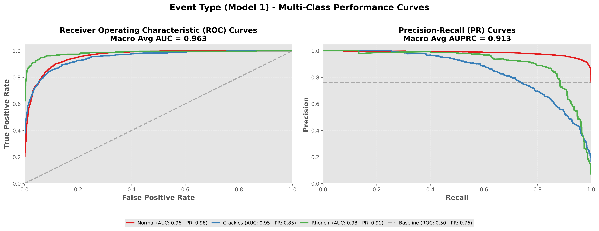

# LightGBM Meta-Model Report: Event Type (Model 1)

## Overview

# Model 1 equal to Sound Pattern Recognition Model

This meta-model predicts **Event Type (Model 1)** using ensemble model probabilities and demographic features.

**Input Features (11 total):**
- Model 1 probabilities (3): Normal, Crackles, Rhonchi
- Model 2 probabilities (2): Normal, Abnormal
- Model 3 probabilities (3): Normal, Pneumonia, Bronchiolitis
- Demographics (3): age, gender, recording_location

**Output Classes:** 3
- Normal, Crackles, Rhonchi

---

## Performance Metrics (with 95% Confidence Intervals)

### Basic Metrics

#### Accuracy
- **Value**: 0.9098
- **CI95**: [0.9019, 0.9178]

#### Macro F1
- **Value**: 0.8490
- **CI95**: [0.8343, 0.8631]

#### Weighted F1
- **Value**: 0.9069
- **CI95**: [0.8982, 0.9154]

#### Matthews Correlation Coefficient (MCC)
- **Value**: 0.7565
- **CI95**: [0.7357, 0.7767]

### Probabilistic Metrics

#### Log-Loss
- **Value**: 0.2449
- **CI95**: [0.2250, 0.2650]

#### ROC-AUC (One-vs-Rest)

**Macro Average:**
- **Value**: 0.9632
- **CI95**: [0.9573, 0.9689]

**Weighted Average:**
- **Value**: 0.9579
- **CI95**: [0.9512, 0.9641]

### Per-Class Metrics

| Class | Precision (PPV) | Recall (Sensitivity) | F1-Score | Specificity | NPV | Support | ROC-AUC (OvR) |
|-------|------------------|----------------------|----------|-------------|-----|---------|---------------|
| Normal | 0.9289 [0.9205, 0.9367] | 0.9663 [0.9607, 0.9719] | 0.9472 [0.9421, 0.9522] | 0.7616 [0.7375, 0.7854] | 0.8751 [0.8551, 0.8943] | 3743 | 0.9575 [0.9508, 0.9642] |
| Crackles | 0.8151 [0.7866, 0.8418] | 0.6827 [0.6507, 0.7159] | 0.7429 [0.7182, 0.7673] | 0.9691 [0.9637, 0.9743] | 0.9386 [0.9306, 0.9459] | 813 | 0.9484 [0.9399, 0.9561] |
| Rhonchi | 0.8805 [0.8441, 0.9125] | 0.8346 [0.7955, 0.8708] | 0.8568 [0.8279, 0.8831] | 0.9914 [0.9886, 0.9940] | 0.9875 [0.9843, 0.9906] | 345 | 0.9836 [0.9749, 0.9899] |

---

## Visualizations

### Confusion Matrix

### ROC and Precision-Recall Curves

Each class has its own ROC curve (left) and Precision-Recall curve (right) in a one-vs-rest setting.

---

**Report Generated**: 2026-01-25 00:45:49
