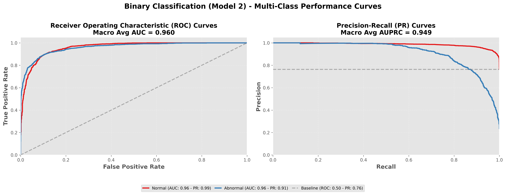

# LightGBM Meta-Model Report: Binary Classification (Model 2)
# Model 2 equal to Screening Model Model
## Overview

This meta-model predicts **Binary Classification (Model 2)** using ensemble model probabilities and demographic features.

**Input Features (11 total):**
- Model 1 probabilities (3): Normal, Crackles, Rhonchi
- Model 2 probabilities (2): Normal, Abnormal
- Model 3 probabilities (3): Normal, Pneumonia, Bronchiolitis
- Demographics (3): age, gender, recording_location

**Output Classes:** 2
- Normal, Abnormal

---

## Performance Metrics (with 95% Confidence Intervals)

### Basic Metrics

#### Accuracy
- **Value**: 0.9234
- **CI95**: [0.9161, 0.9306]

#### Macro F1
- **Value**: 0.8891
- **CI95**: [0.8786, 0.8993]

#### Weighted F1
- **Value**: 0.9216
- **CI95**: [0.9142, 0.9292]

#### Matthews Correlation Coefficient (MCC)
- **Value**: 0.7813
- **CI95**: [0.7609, 0.8014]

### Probabilistic Metrics

#### Log-Loss
- **Value**: 0.2036
- **CI95**: [0.1856, 0.2205]

#### ROC-AUC (Binary)
- **Value**: 0.9600
- **CI95**: [0.9538, 0.9666]

### Per-Class Metrics

| Class | Precision (PPV) | Recall (Sensitivity) | F1-Score | Specificity | NPV | Support | ROC-AUC (OvR) |
|-------|------------------|----------------------|----------|-------------|-----|---------|---------------|
| Normal | 0.9333 [0.9255, 0.9409] | 0.9688 [0.9633, 0.9742] | 0.9507 [0.9459, 0.9556] | 0.7768 [0.7542, 0.8018] | 0.8855 [0.8665, 0.9039] | 3743 | N/A |
| Abnormal | 0.8855 [0.8665, 0.9039] | 0.7768 [0.7542, 0.8018] | 0.8275 [0.8105, 0.8446] | 0.9688 [0.9633, 0.9742] | 0.9333 [0.9255, 0.9409] | 1158 | N/A |

---

## Visualizations

### Confusion Matrix

### ROC and Precision-Recall Curves

Each class has its own ROC curve (left) and Precision-Recall curve (right) in a one-vs-rest setting.

---

**Report Generated**: 2026-01-25 00:45:58
