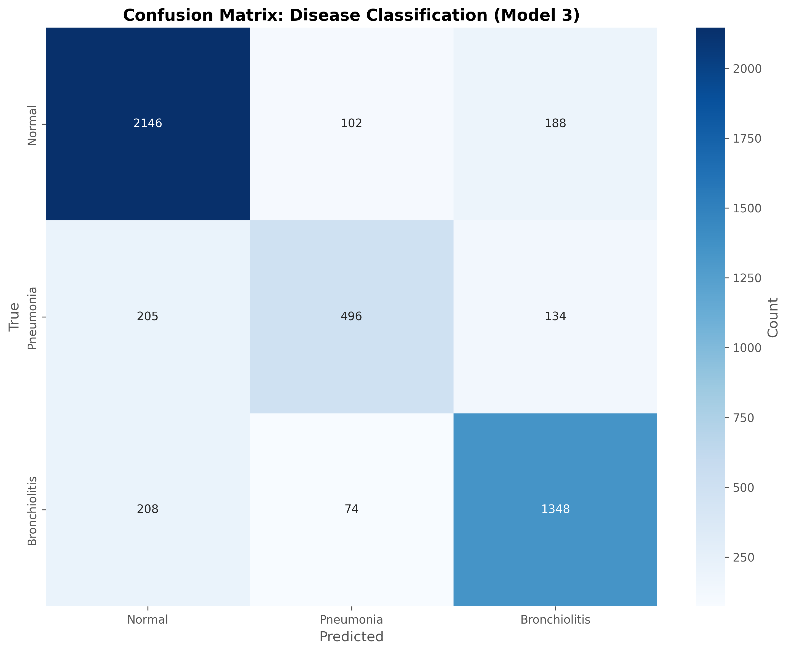
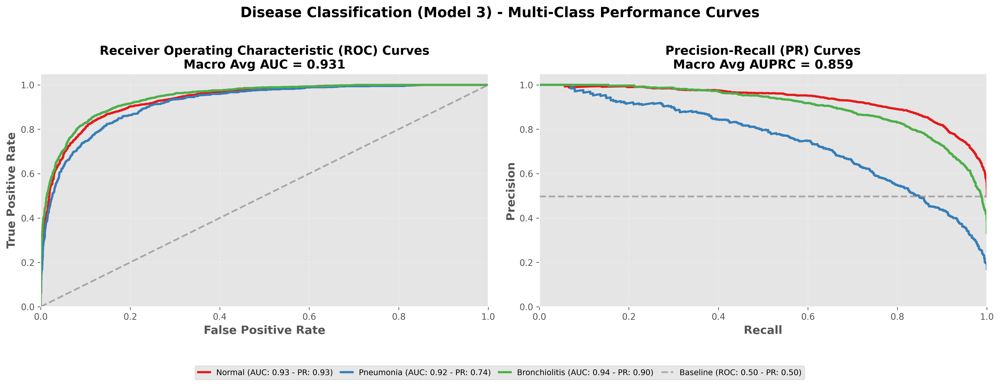

# LightGBM Meta-Model Report: Disease Classification (Model 3)

## Overview

This meta-model predicts **Disease Classification (Model 3)** using ensemble model probabilities and demographic features.

**Input Features (11 total):**
- Model 1 probabilities (3): Normal, Crackles, Rhonchi
- Model 2 probabilities (2): Normal, Abnormal
- Model 3 probabilities (3): Normal, Pneumonia, Bronchiolitis
- Demographics (3): age, gender, recording_location

**Output Classes:** 3
- Normal, Pneumonia, Bronchiolitis

---

## Performance Metrics (with 95% Confidence Intervals)

### Basic Metrics

#### Accuracy
- **Value**: 0.8142
- **CI95**: [0.8033, 0.8241]

#### Macro F1
- **Value**: 0.7781
- **CI95**: [0.7643, 0.7904]

#### Weighted F1
- **Value**: 0.8110
- **CI95**: [0.7998, 0.8217]

#### Matthews Correlation Coefficient (MCC)
- **Value**: 0.6934
- **CI95**: [0.6750, 0.7096]

### Probabilistic Metrics

#### Log-Loss
- **Value**: 0.4703
- **CI95**: [0.4497, 0.4913]

#### ROC-AUC (One-vs-Rest)

**Macro Average:**
- **Value**: 0.9312
- **CI95**: [0.9252, 0.9367]

**Weighted Average:**
- **Value**: 0.9336
- **CI95**: [0.9278, 0.9391]

### Per-Class Metrics

| Class | Precision (PPV) | Recall (Sensitivity) | F1-Score | Specificity | NPV | Support | ROC-AUC (OvR) |
|-------|------------------|----------------------|----------|-------------|-----|---------|---------------|
| Normal | 0.8384 [0.8238, 0.8520] | 0.8812 [0.8682, 0.8935] | 0.8592 [0.8487, 0.8690] | 0.8322 [0.8160, 0.8474] | 0.8763 [0.8627, 0.8886] | 2436 | 0.9329 [0.9262, 0.9390] |
| Pneumonia | 0.7380 [0.7060, 0.7699] | 0.5936 [0.5599, 0.6247] | 0.6578 [0.6288, 0.6825] | 0.9568 [0.9503, 0.9629] | 0.9199 [0.9114, 0.9279] | 835 | 0.9179 [0.9075, 0.9267] |
| Bronchiolitis | 0.8077 [0.7884, 0.8260] | 0.8270 [0.8074, 0.8461] | 0.8172 [0.8014, 0.8311] | 0.9018 [0.8918, 0.9119] | 0.9127 [0.9024, 0.9227] | 1630 | 0.9428 [0.9362, 0.9491] |

---

## Visualizations

### Confusion Matrix

### ROC and Precision-Recall Curves

Each class has its own ROC curve (left) and Precision-Recall curve (right) in a one-vs-rest setting.

---

**Report Generated**: 2026-01-25 00:46:16
