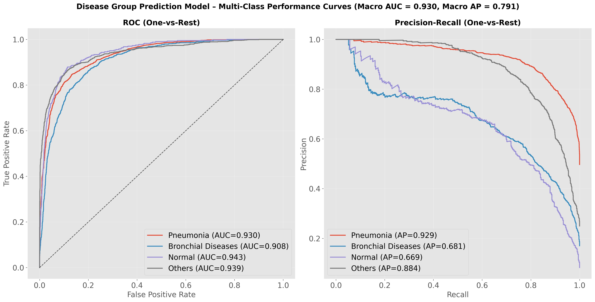

# LightGBM Meta-Model Report: Disease Category (Model 4)
# Model 2 equal to Disease Group Prediction Model

## Overview

This meta-model predicts **Disease Category (Model 4)** using ensemble model probabilities and demographic features.

**Input Features (11 total):**
- Model 1 probabilities (3): Normal, Crackles, Rhonchi
- Model 2 probabilities (2): Normal, Abnormal
- Model 3 probabilities (3): Normal, Pneumonia, Bronchiolitis
- Demographics (3): age, gender, recording_location

**Output Classes:** 4
- Pneumonia, Bronchial Diseases, Normal, Others

---

## Performance Metrics (with 95% Confidence Intervals)

### Basic Metrics

#### Accuracy
- **Value**: 0.7950
- **CI95**: [0.7827, 0.8062]

#### Macro F1
- **Value**: 0.7382
- **CI95**: [0.7222, 0.7537]

#### Weighted F1
- **Value**: 0.7902
- **CI95**: [0.7776, 0.8023]

#### Matthews Correlation Coefficient (MCC)
- **Value**: 0.6823
- **CI95**: [0.6638, 0.6992]

### Probabilistic Metrics

#### Log-Loss
- **Value**: 0.5355
- **CI95**: [0.5124, 0.5582]

#### ROC-AUC (One-vs-Rest)

**Macro Average:**
- **Value**: 0.9383
- **CI95**: [0.9329, 0.9437]

**Weighted Average:**
- **Value**: 0.9361
- **CI95**: [0.9306, 0.9414]

### Per-Class Metrics

| Class | Precision (PPV) | Recall (Sensitivity) | F1-Score | Specificity | NPV | Support | ROC-AUC (OvR) |
|-------|------------------|----------------------|----------|-------------|-----|---------|---------------|
| Pneumonia | 0.8200 [0.8056, 0.8351] | 0.8888 [0.8765, 0.9005] | 0.8530 [0.8426, 0.8630] | 0.8072 [0.7915, 0.8235] | 0.8802 [0.8666, 0.8930] | 2436 | 0.9296 [0.9225, 0.9362] |
| Bronchial Diseases | 0.7450 [0.7158, 0.7763] | 0.6260 [0.5947, 0.6571] | 0.6802 [0.6551, 0.7044] | 0.9506 [0.9437, 0.9573] | 0.9168 [0.9081, 0.9253] | 920 | 0.9183 [0.9093, 0.9270] |
| Normal | 0.7109 [0.6592, 0.7636] | 0.5383 [0.4891, 0.5889] | 0.6123 [0.5683, 0.6541] | 0.9803 [0.9760, 0.9842] | 0.9593 [0.9535, 0.9651] | 405 | 0.9438 [0.9331, 0.9547] |
| Others | 0.7936 [0.7704, 0.8162] | 0.8218 [0.7977, 0.8449] | 0.8074 [0.7894, 0.8245] | 0.9351 [0.9273, 0.9427] | 0.9453 [0.9376, 0.9527] | 1140 | 0.9615 [0.9559, 0.9671] |

---

## Visualizations

### Confusion Matrix

### ROC and Precision-Recall Curves

Each class has its own ROC curve (left) and Precision-Recall curve (right) in a one-vs-rest setting.

---

**Report Generated**: 2026-01-25 00:46:39
