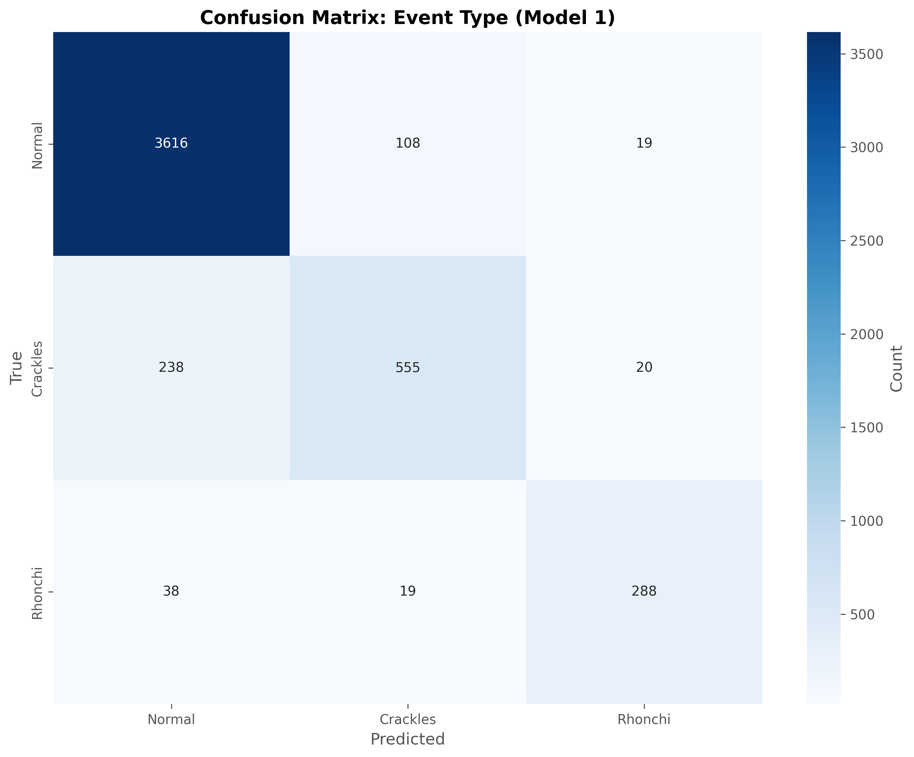
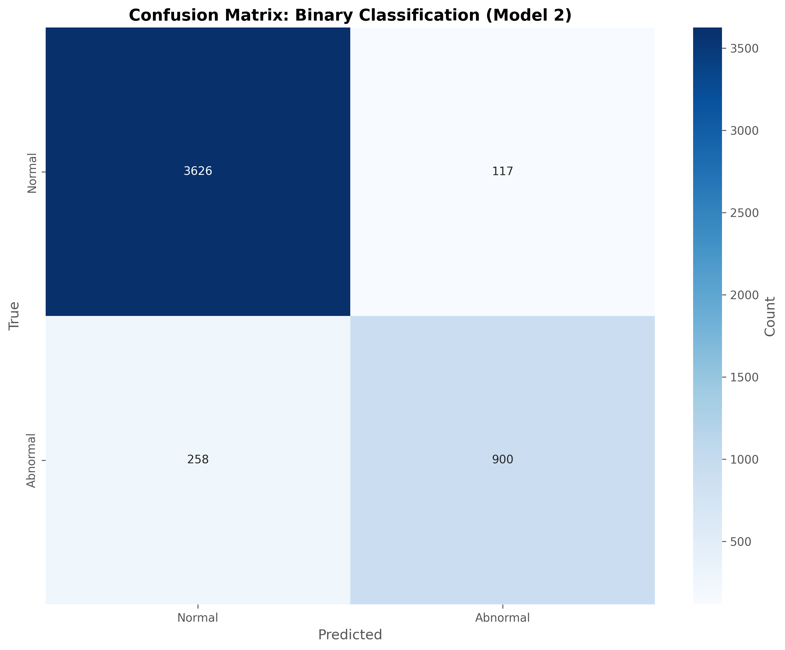
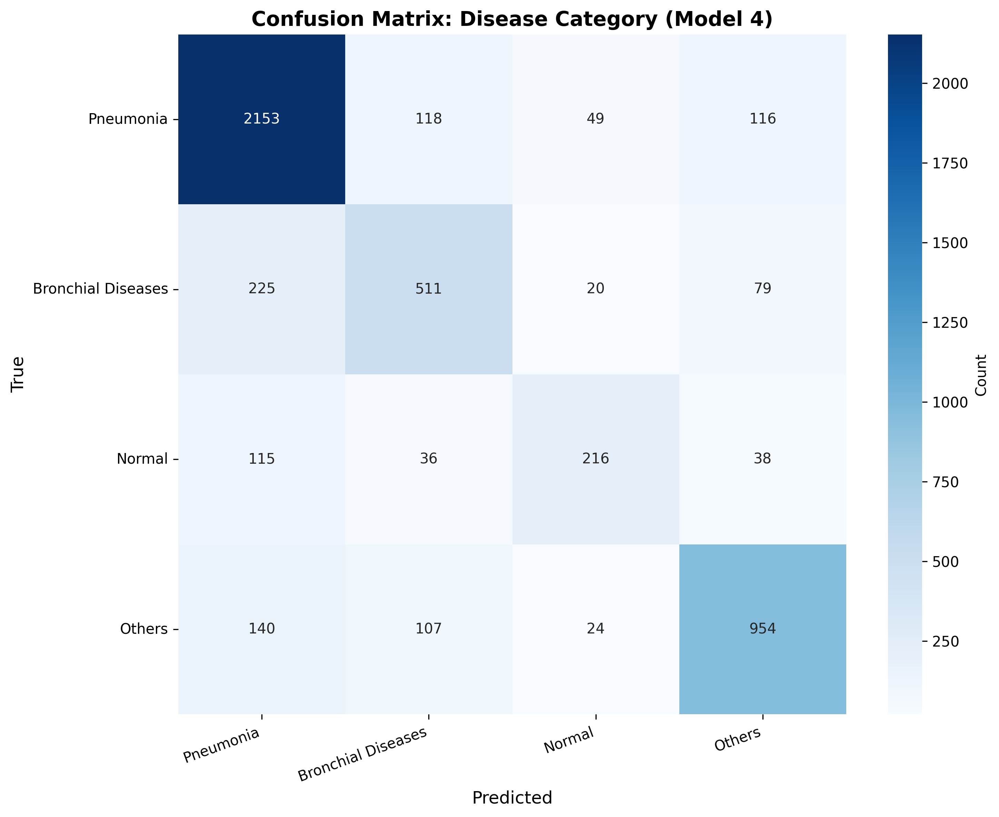
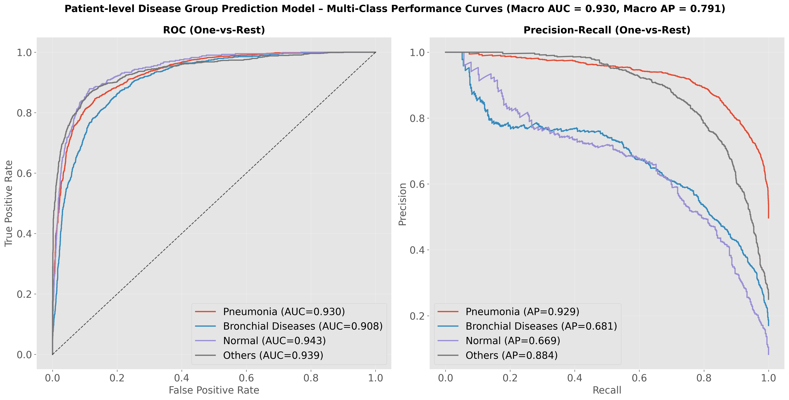
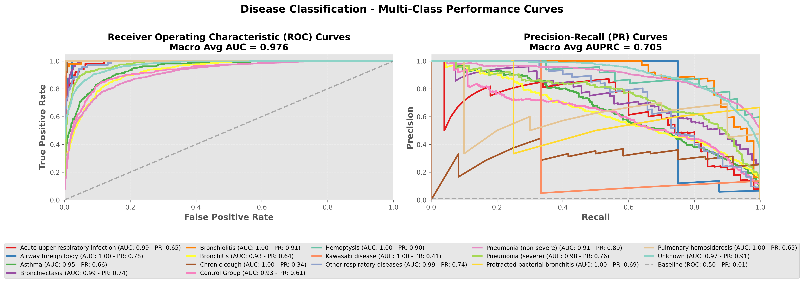
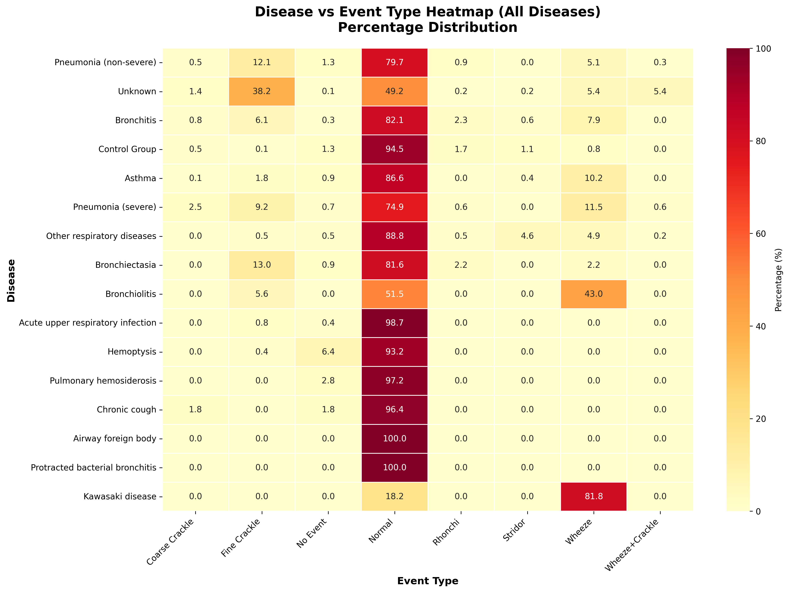

# Supplementary Materials

This document contains all supplementary tables and figures referenced in the manuscript.

---

## Supplementary Table S1. Sixteen-disease distribution in the SPRSound cohort

Full distribution of 16 diseases with train/test patient counts and event counts.

| Disease | Train patients | Test patients | Train events | Test events |
|---------|----------------|---------------|--------------|-------------|
| Pneumonia (non-severe) | 323 | 81 | 8968 | 2099 |
| Unknown | 94 | 26 | 3793 | 1020 |
| Bronchitis | 88 | 18 | 1857 | 465 |
| Control Group | 55 | 19 | 1615 | 429 |
| Asthma | 54 | 12 | 1385 | 207 |
| Pneumonia (severe) | 30 | 11 | 966 | 305 |
| Bronchiolitis | 7 | 1 | 298 | 7 |
| Other respiratory diseases | 11 | 5 | 247 | 164 |
| Bronchiectasia | 5 | 3 | 202 | 114 |
| Acute upper respiratory infection | 9 | 2 | 198 | 38 |
| Hemoptysis | 2 | 2 | 143 | 91 |
| Chronic cough | 4 | 0 | 55 | 0 |
| Airway foreign body | 2 | 0 | 38 | 0 |
| Pulmonary hemosiderosis | 1 | 1 | 32 | 40 |
| Protracted bacterial bronchitis | 1 | 0 | 21 | 0 |
| Kawasaki disease | 0 | 1 | 0 | 11 |

---

## Supplementary Table S2. Label mapping from original annotations to study targets

**Part A – Event type → Sound pattern:**

| Original event label | Sound pattern |
|----------------------|---------------|
| Normal | Normal |
| Fine Crackle | Crackles |
| Coarse Crackle | Crackles |
| Wheeze+Crackle | Crackles |
| Wheeze | Rhonchi |
| Stridor | Rhonchi |
| Rhonchi | Rhonchi |
| No Event | Excluded |

**Part B – Original diagnosis → 4 disease group:**

| Original diagnosis | 4 Disease group |
|--------------------|-----------------|
| Pneumonia (severe) | Pneumonia |
| Pneumonia (non-severe) | Pneumonia |
| Asthma | Bronchial Diseases |
| Bronchitis | Bronchial Diseases |
| Bronchiolitis | Bronchial Diseases |
| Control Group | Normal |
| Acute upper respiratory infection | Others |
| Airway foreign body | Others |
| Bronchiectasia | Others |
| Chronic cough | Others |
| Hemoptysis | Others |
| Kawasaki disease | Others |
| Other respiratory diseases | Others |
| Protracted bacterial bronchitis | Others |
| Pulmonary hemosiderosis | Others |
| Unknown | Others |

---

## Supplementary Table S3. Additional classification results for 6-class event type and 16-disease models

| Model | Classes | Accuracy | Macro F1 | MCC | ROC-AUC (macro) |
|-------|---------|----------|----------|-----|-----------------|
| Event type (6-class) | Coarse Crackle, Fine Crackle, Normal, Rhonchi, Wheeze, Wheeze+Crackle | 0.9007 | 0.6714 | 0.7332 | 0.965 |
| Disease (16-class) | All 16 diagnoses (see Table S1) | 0.7445 | 0.5991 | 0.6451 | 0.9763 |

---

## Supplementary Table S4. Final hyperparameters for base models and LightGBM meta-models

| Component | Parameter | Value |
|-----------|-----------|-------|
| HeAR encoder | Model | google/hear-pytorch |
| HeAR encoder | Embedding dim | 512 |
| Classification head | Hidden dim | 256 |
| Classification head | Dropout | 0.3 |
| Training | Phase 1 epochs | 10 (frozen encoder) |
| Training | Phase 2 epochs | 40 (fine-tune) |
| Training | Batch size | 32 |
| Training | Learning rate (Phase 1) | 1e-4 |
| Training | Learning rate (Phase 2) | 5e-7 |
| LightGBM | n_estimators | 50–500 (Optuna) |
| LightGBM | max_depth | 3–15 |
| LightGBM | learning_rate | 0.01–0.3 (log) |
| LightGBM | num_leaves | 15–300 |
| LightGBM | min_child_samples | 5–100 |
| LightGBM | subsample | 0.6–1.0 |
| LightGBM | colsample_bytree | 0.6–1.0 |
| LightGBM | early_stopping_rounds | 20 |
| LightGBM | Optimization | Optuna TPE, 100 trials |

---

## Supplementary Figure S1. Confusion matrices for event-level tasks

**Sound pattern (3-class)**



**Binary (Normal/Abnormal)**



**Event type (6-class)**


**Disease group (4-class)**



**ROC and Precision-Recall curves (Disease group, 4-class)**



**ROC and Precision-Recall curves (Disease, 16-class)**



---

## Disease vs Event Type Heatmap



---

## File structure

```
supplementary/
├── SUPPLEMENTARY.md
├── figures/
│   ├── fig1_disease_event_heatmap_all.png
│   ├── fig_s1a_model1_label_confusion.png
│   ├── fig_s1a_model2_label_confusion.png
│   ├── fig_s1a_event_type_confusion.png
│   ├── fig_s1a_model4_label_confusion.png
│   ├── fig_s1b_disease_group_roc_pr.png
│   └── fig_s1b_disease_16class_roc_pr.png
└── tables/
    ├── s1_sixteen_disease_distribution.csv
    ├── s2a_event_to_sound_pattern.csv
    ├── s2b_diagnosis_to_four_group.csv
    ├── s3_additional_model_results.csv
    ├── s4_hyperparameters.csv
    ├── disease_event_pivot_counts.csv
    ├── disease_event_pivot_percentages.csv
    ├── table1_train_test.csv
    └── table2_disease_full.csv
```
